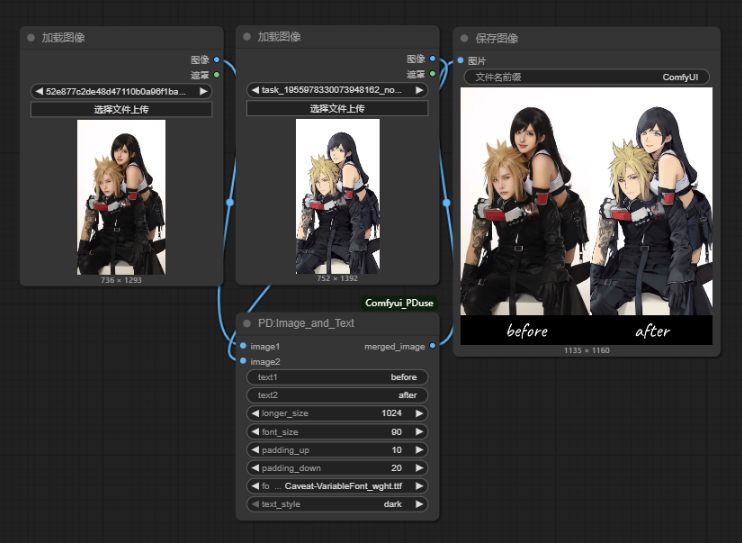
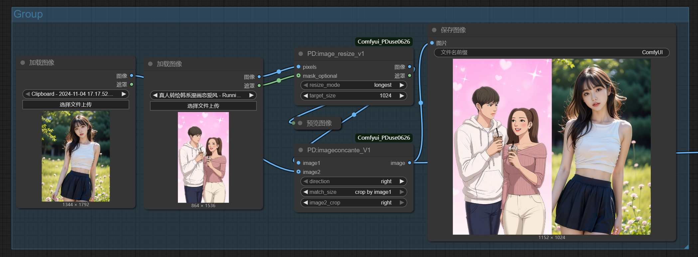
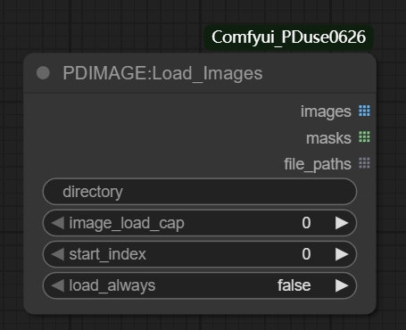
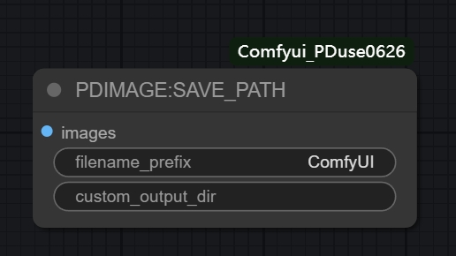
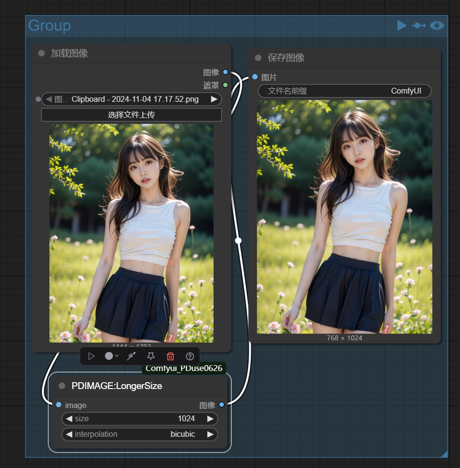
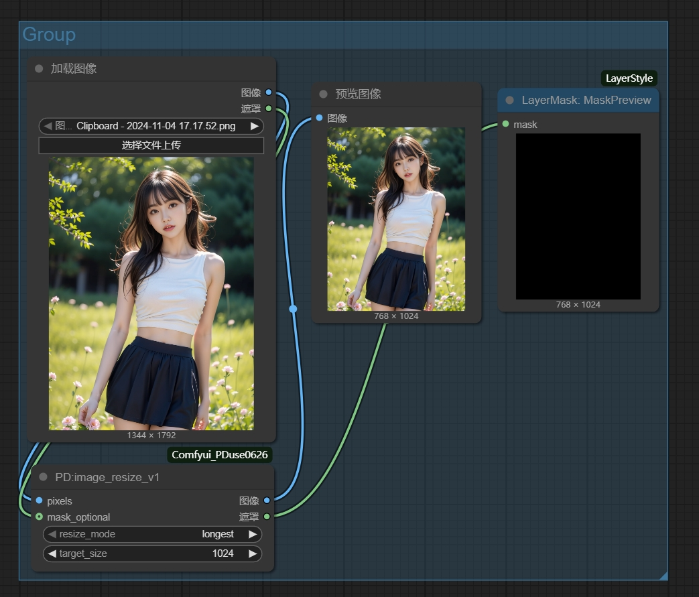
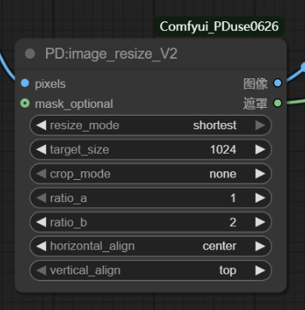
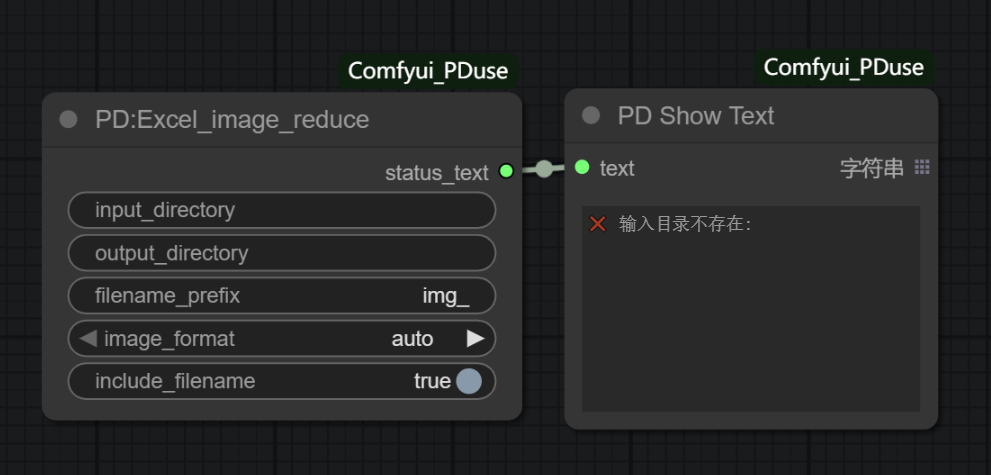

[工作流合集](https://github.com/7BEII/Comfyui_PDuse/tree/master/img)|[视频介绍](https://www.bilibili.com/video/BV11TVwzYE9y/?spm_id_from=333.1387.collection.video_card.click&vd_source=fc2e074d346648621ecd8ea61bc80073)|[节点介绍文档](https://kfecan834o.feishu.cn/wiki/Eeyuw2rDiisTVkk30GRcHsmBnld?from=from_copylink)

## 🚀 特色和节点介绍：
- Comfyui PDuse 制作是方便处理一些 常用的图像 json 和txt 各种繁琐python操作集成到comfyui节点里面，后续有空会持续维护。
- 
  
## ⚡ 安装方法

#### 方法一：Git克隆
```bash
cd ComfyUI/custom_nodes
git clone https://github.com/your-username/Comfyui_PDuse.git
cd Comfyui_PDuse
pip install -r requirements.txt
```

#### 方法二：手动下载
1. 从releases下载ZIP文件 or 网盘 PD源代码备份：https://pan.quark.cn/s/ac4cf8544857#/list/share
2. 解压到`ComfyUI/custom_nodes/`
3. 安装依赖：`pip install -r requirements.txt`
   

## 📖 节点说明

### text处理

##### PD Show Text
> 文本显示节点，用于在ComfyUI界面中显示文本信息，通常用于显示处理结果、状态报告或调试信息。

- text：要显示的文本内容（支持来自其他节点的文本输出）

**功能特点：**
- ✅ 在工作流中实时显示文本信息
- ✅ 支持显示处理结果和状态报告
- ✅ 可用于调试和监控节点执行状态
- ✅ 支持多行文本显示
- ✅ 自动保存到工作流信息中

**使用场景：**
- 显示文件处理统计信息
- 显示错误信息和警告
- 监控批处理进度
- 调试工作流执行状态

##### PD:Image_and_Text

> 字体文件可以放入文件夹fonts 。
> 将两张图片左右合并，并在底部添加文字标注的ComfyUI节点。

- image1+ ​​​​image2 ：尽量要求同样尺寸，如果不同，会自动等比例缩放对齐
- text1 + text2   ：支持中文，需字体文件包含中文编码，可输入如"效果图"："原图"之类
- font_size​：小于20可能看不清，大于90可能超出画布
- ​​padding_up​：文字​​上方​​的留白高度，10-30
- ​​padding_down：文字​**​下方​**​的留白高度  10- 1000 ,可以往下扩多一些方便排版
- font_file​  选择字体样式, 需将.ttf/.otf文件放入插件目录的fonts文件夹
- longer_size ： 单张图的最长边尺寸限制
##### PD_Text Overlay Node

> 给图片添加文字，并且指定位置贴上去。

- image：要处理的输入图片
- text：需要叠加的文字内容 
- font_size：字体大小 
- font_color：文字颜色，使用HEX格式，如#000000 
- position_x：文字水平位置（0到1，0是左，1是右） 
- position_y：文字垂直位置（0到1，0是上，1是下） 
- letter_gap：字符间距（可为负数，负数使字母靠近）
- font_name：使用的字体文件名（从fonts目录中选择）

##### PD_Add Label
> 在图像四边添加标签文字，支持百分比定位和多方向添加。

- 位置控制: text_x(1-100) 和 text_y(1-100) 百分比定位
- 标签尺寸: height(1-1000) 控制标签区域大小
- 文字样式: font_size(8-200) 和 font 选择
- 颜色模式:
  - light = 白底黑字
  - dark = 黑底白字
- 添加方向: up/down/left/right 四个方向

##### PD加载文本文件夹(输出列表)

> 批量读取文件夹内的文本文件（.txt, .json等），输出内容列表。

- directory_path：文件夹路径
- limit_count：读取数量限制

##### PD加载文本ZIP(输出列表)
.png)
> 上传ZIP压缩包，自动解压并批量读取其中的文本文件。

- zip_file_upload：ZIP文件上传
- 输出：文本内容列表、拼接文本

##### PD保存文本(路径+文件名)
> 批量保存文本文件节点，接收文本内容列表和文件名列表，按对应关系将文本保存到指定目录。与 PD加载文本文件夹 节点配套使用。

- output_directory：输出文件夹路径（必填）
- text_list：文本内容列表（列表输入）
- filename_text：文件名列表（多行文本，每行一个文件名）

**功能特点：**
- ✅ 支持批量文本文件保存
- ✅ 自动创建输出目录（如果不存在）
- ✅ 按输入顺序一一对应保存（filename[0] → text_list[0]）
- ✅ 自动添加 .txt 扩展名（如果文件名没有扩展名）
- ✅ UTF-8 编码保存，完美支持中文
- ✅ 详细的保存报告和错误处理
- ✅ 数量不匹配时自动取最小值保存

**使用场景：**
- 批量保存图像标注文本
- 批量保存提示词文件
- 文本内容的批量导出
- 配合加载文本节点进行文本处理流程

**对应关系示例：**
```
text_list = ["内容1", "内容2", "内容3"]
filename_text = "10_R.txt\n11_R.txt\n12_R.txt"

保存结果：
- 10_R.txt → 保存"内容1"
- 11_R.txt → 保存"内容2"  
- 12_R.txt → 保存"内容3"
```

##### PD 字符串转json (语言自动检测)
> 将输入的字符串转换为包含caption和lang字段的JSON格式字符串，支持批量处理。

- text：输入文本内容（必需，支持列表批处理）
- lang：语言代码（可选，默认"en"，可选：en/zh/ja/ko/auto等）

**功能特点：**
- ✅ 支持批量文本列表输入输出
- ✅ 自动语言检测（中文/英文/日文/韩文）
- ✅ 输出标准JSON格式：`{"caption": "...", "lang": "en"}`
- ✅ 保持输入输出顺序完全一致
- ✅ UTF-8编码，完美支持中文

**使用示例：**
```
输入: "This is a photography work..."
输出: {"caption": "This is a photography work...", "lang": "en"}
```

##### PD_CaptionJSON编辑器
> 解析并编辑JSON格式的caption字符串，支持替换词语、添加前后缀等批量操作。

- json_string：输入JSON字符串（必需，支持列表批处理）
- new_caption：完全替换caption内容（可选）
- add_prefix：在caption前添加文本（可选）
- add_suffix：在caption后添加文本（可选）
- replace_from：要替换的词语（每行一个，可选）
- replace_to：替换为的词语（每行一个，可选）
- new_lang：修改语言代码（可选，默认"en"）

**功能特点：**
- ✅ 支持批量JSON编辑
- ✅ 多种编辑操作：完全替换、词语替换、前后缀添加
- ✅ 输出完整JSON字符串、caption文本、语言代码
- ✅ 保持输入输出顺序一致

**使用场景：**
- 批量修改训练数据标注
- 添加通用前缀后缀词（如quality tags）
- 批量替换或删除特定词语
- 修改语言标签

##### PD_CaptionJSON解析器
> 解析JSON格式的caption字符串，快速提取caption和lang字段，支持批量处理。

- json_string：输入JSON字符串（必需，支持列表批处理）

**输出：**
- caption：提取的caption文本列表
- lang：语言代码列表

**功能特点：**
- ✅ 快速批量解析JSON
- ✅ 自动提取caption和lang字段
- ✅ 解析失败时智能降级处理
- ✅ 保持输入输出顺序一致

##### PD text_list_string_add word
> 批量为字符串添加词语，支持前缀、后缀、替换、插入等多种操作，适用于文本批处理。

- text：输入文本内容（必需，支持列表批处理）
- add_prefix：在文本前添加词语（可选）
- add_suffix：在文本后添加词语（可选）
- replace_from：要替换的词语（每行一个，可选）
- replace_to：替换为的词语（每行一个，可选）
- insert_word：要插入的词语（可选）
- insert_position：插入位置（字符索引，默认0）
- separator：词语分隔符（默认空格）

**功能特点：**
- ✅ 支持批量文本处理
- ✅ 前缀、后缀、替换、插入多种操作
- ✅ 自定义分隔符
- ✅ 保持输入输出顺序一致

**使用示例：**
```
输入: "a beautiful woman"
add_prefix: "masterpiece, best quality,"
add_suffix: ", 4k, ultra detailed"
输出: "masterpiece, best quality, a beautiful woman, 4k, ultra detailed"
```

##### PD文本列表打包
> 将多个文本内容和对应的文件名打包成列表格式，可与文本加载、排序等节点配合使用。

- text_1~5：文本内容输入（最多5个，可选）
- filename_1~5：对应的文件名（可选）
- input_text_list：直接输入文本列表（可选）
- input_filename_text：与列表配套的文件名（可选）

**输出：**
- text_list：文本列表
- filename_text：文件名列表（多行文本）
- count：文本数量

##### PD文本列表解包
> 从文本列表中提取单个文本项，与文本列表打包节点配套使用。

##### PD文本列表排序
> 对文本列表和对应的文件名进行排序整理。

##### PD:imageconcante_V1

> 两张图片按指定方向拼接合并。

- image1：输入图片1（必填）
- image2：输入图片2（可选，不填时只输出image1）
- direction：合并方向（right/down/left/up）
- match_size：尺寸对齐方式（longest/crop by image1）
- image2_crop：裁切位置（center/top/bottom/left/right）

### image处理

##### PDIMAGE:Load_Images

> 批量图片加载节点，从指定目录中加载多张图片，支持多种加载选项和缓存控制。

- directory：图片文件夹路径（必填）
- image_load_cap：加载数量限制（0为无限制）
- start_index：起始索引（从第几张开始加载）
- load_always：强制重新加载（True时忽略缓存）

##### PDIMAGE_SAVE_PATH

> 图片保存路径管理节点，设置和管理图片的保存路径，支持自定义文件名格式。

- save_path：保存路径设置
- filename_format：文件名格式（支持前缀、后缀）
- create_subdirs：是否创建子目录

##### PDIMAGE_SAVE_PATHV2

> 增强版图片保存路径管理节点，支持多种图片格式、时间令牌和智能文件命名。

- filename_prefix：文件名前缀（支持时间令牌）
- custom_output_dir：自定义输出目录路径
- filename_delimiter：文件名分隔符
- filename_number_padding：数字填充位数
- extension：文件格式选择
- quality：图像质量控制（1-100）
- embed_metadata：元数据嵌入控制
- overwrite_mode：覆盖模式选择

##### PD:Image Blend V1

> 将两张图片进行混合，支持多种混合模式、透明度控制和位置调整。
- background_image：背景图像（必填）
- layer_image：图层图像（必填）
- blend_mode：混合模式（normal/multiply/screen/overlay等）
- opacity：透明度（0-100）
- x_percent/y_percent：位置百分比（50为居中）
- scale：缩放比例（0.01到10）
- align_mode：对齐模式
- layer_mask：可选图层遮罩
- invert_mask：是否反转遮罩

##### PD:Image Ratio Crop

> 根据指定比例和最长边长度进行中心裁切，支持自定义比例和输出尺寸。

- image：输入图像张量
- ratio_a：比例A（1-100）
- ratio_b：比例B（1-100）
- max_size：输出图像的最长边长度

##### PD:longgersize

> 将图像的长边缩放到指定尺寸，同时保持宽高比，短边按比例缩放。

- image：输入图像
- size：目标长边尺寸
- interpolation：插值方式

##### PD:image_resize_v1

> 图片缩放节点，支持通过最长边或最短边缩放图片，输出缩放后的图片和mask。

- pixels：输入图片张量
- resize_mode：缩放模式（longest/shortest）
- target_size：目标尺寸（64-8192）
- mask_optional：可选的mask输入

##### PD:imagesize_v2

> 图片缩放裁切节点V2，支持三种处理模式：纯缩放、比例裁切、强制拉伸。

- pixels：输入图片张量
- resize_mode：缩放模式（longest/shortest）
- target_size：目标尺寸（64-8192）
- crop_mode：裁切模式（none/crop/stretch）
- ratio_a/ratio_b：目标比例（1-100）
- horizontal_align：水平对齐方式
- vertical_align：垂直对齐方式
- mask_optional：可选的mask输入

##### PD_image ratiosize

> 基于最长边的智能分辨率计算节点，根据宽高比和最长边尺寸自动计算图像分辨率，特别适合AI图像生成工作流。

- max_dimension：最长边尺寸（256-4096，默认1024）
- aspect_ratio：宽高比选择（3:4竖向、4:3横向、1:1正方形）
- divisible_by：整除要求（8/16/32/64，默认64）

**功能特点：**
- ✅ 基于最长边计算，符合用户习惯
- ✅ 确保分辨率能被64整除，AI模型友好
- ✅ 提供直观的预览图像显示
- ✅ 支持多种常用宽高比
- ✅ 输出整数值，可直接连接其他节点

**计算示例：**
- 3:4比例 + 1024最长边 → 768×1024
- 4:3比例 + 1024最长边 → 1024×768  
- 1:1比例 + 1024最长边 → 1024×1024

**输出内容：**
- width：计算出的宽度（INT）
- height：计算出的高度（INT）
- resolution：分辨率字符串（如"768 x 1024"）
- preview：预览图像（显示计算结果）

##### PD_CropBorder

> 智能图像边框裁切节点，自动检测并移除图片边缘的黑色或白色边框。

- image：输入图像张量
- border_color：要移除的边框颜色（black/white）
- threshold：颜色检测阈值（0-255）
- padding：裁切后保留的边距像素（0-100）

##### PD_BatchCropBlackBorder

> 批量图像边框裁切节点，批量处理文件夹中的所有图片，自动检测并移除边框。

- input_path：输入图片文件夹路径（必填）
- border_color：要移除的边框颜色（black/white）
- threshold：颜色检测阈值（0-255）
- padding：裁切后保留的边距像素（0-100）
- output_path：输出路径（可选，不填则覆盖原图）

##### PD:remove_background
> 智能背景移除节点，去除图像中的黑色背景，输出原图和透明度掩码，支持阈值调节和边缘平滑。

- image：输入图像张量（必填）
- threshold：黑色检测阈值（0.0-1.0，默认0.9）
- smooth_edges：是否平滑边缘（可选，默认True）
- invert_mask：是否反转掩码（可选，默认True）

**输出：**
- image：原始图像（保持输入尺寸不变）
- mask：透明度掩码（白色=保留区域，黑色=透明区域）


##### PDJSON_Group

> JSON文件输出路径和格式设置节点。

- directory_path：JSON文件输出目录路径
- color_choice：颜色选择
- modify_size：尺寸修改选项
- font_size：字体大小
- target_title：目标标题
- output_folder：输出文件夹
- new_filename：新文件名

##### PD加载图片ZIP(输出列表)
.png)
> 上传ZIP压缩包，自动解压并批量读取其中的图片文件。

- zip_file_upload：ZIP文件上传
- 输出：图片列表、文件名列表

##### PD双图批处理(列表输入)
.png)
> 基于文件名的图片列表智能匹配节点，支持前后缀匹配。

- image1_list/image2_list：两组输入图片
- name1_list/name2_list：两组对应的文件名
- 匹配模式：支持后缀(_T/_R)或前缀匹配，自动对齐两组图片

### 文件处理

##### PD aitookit training redux
> AI训练数据分类整理节点，将配对的图片和文本文件与未配对的文件自动分类到不同文件夹，方便整理训练数据集。

- source_folder：源文件夹路径（必需）
- paired_folder_name：配对文件的子文件夹名称（默认"paired_files"）
- unpaired_folder_name：未配对文件的子文件夹名称（默认"unpaired_files"）
- image_extensions：图片扩展名（默认".png,.jpg,.jpeg,.webp"）
- text_extension：文本扩展名（默认".txt"）

**功能特点：**
- ✅ 智能识别图片和文本的配对关系
- ✅ 按文件名自动分类（如1_R.png + 1_R.txt为配对）
- ✅ 源文件保持不动，仅复制到子文件夹
- ✅ 自动创建分类子文件夹
- ✅ 详细的处理报告和统计信息
- ✅ 支持多种图片格式

**工作原理：**
- 配对文件（有图有文本）→ 复制到 `paired_files/`
- 未配对文件（只有图或只有文本）→ 复制到 `unpaired_files/`

**使用场景：**
- 整理AI训练数据集
- 分离已标注和未标注的数据
- 检查数据集完整性
- 准备训练数据

**示例：**
```
源文件夹/
  ├── 1_R.png + 1_R.txt  → paired_files/
  ├── 1_T.png           → unpaired_files/
  └── 2_R.png + 2_R.txt  → paired_files/
```

##### PD:number_start

> 文件排序重命名节点，将"T_1", "T_2", "T_3"格式的文件名重命名为"1_T", "2_T", "3_T"，T参数可以自定义为其他单词，直接执行重命名操作。

- folder_path：目标文件夹路径（必填）
- target_prefix：目标前缀词（默认为"T"，可自定义为其他单词）

**功能特点：**
- ✅ 智能识别 `前缀_数字` 格式的文件名
- ✅ 按数字顺序重命名，保持正确排序  
- ✅ 支持任意文件扩展名 (.jpg, .png, .txt 等)
- ✅ 详细的操作报告，包含成功/失败/跳过的文件统计
- ✅ 错误处理，避免覆盖已存在的文件

**使用示例：**
- 输入文件：`T_1.jpg`, `T_2.png`, `T_10.txt`
- 输出文件：`1_T.jpg`, `2_T.png`, `10_T.txt`

##### PD:replace_word
> 文件名关键词替换/删除节点，在文件夹中查找包含指定关键词的文件，将关键词替换为新的关键词或删除关键词。支持格式筛选，严格匹配（区分大小写）。

- folder_path：目标文件夹路径（必填）
- old_keyword：要替换/删除的关键词（默认为"R"）
- new_keyword：新的关键词（默认为"start"，留空则删除关键词）
- file_format：文件格式筛选（默认为"full"不限制，可选：jpg/png/txt/jpeg/bmp/gif/webp）

**功能特点：**
- ✅ 智能检索包含指定关键词的文件
- ✅ 严格匹配模式，只替换完全一致的关键词（区分大小写）
- ✅ 支持关键词替换和删除两种操作模式
- ✅ 支持格式筛选，可指定只处理特定格式的文件
- ✅ 详细的操作报告，包含成功/失败/跳过的文件统计
- ✅ 错误处理，避免覆盖已存在的文件
- ✅ 自动跳过无需更改的文件

**使用示例：**
- 原文件：`1_R.jpg`, `2_R.png`, `test_R.txt`
- 设置：old_keyword="R", new_keyword="start", file_format="full"
- 结果文件：`1_start.jpg`, `2_start.png`, `test_start.txt`

**格式筛选示例：**
- 原文件：`1_R.jpg`, `2_R.png`, `test_R.txt`
- 设置：old_keyword="R", new_keyword="start", file_format="jpg"
- 结果文件：`1_start.jpg`（只处理jpg文件）, `2_R.png`, `test_R.txt`（png和txt文件被跳过）

**关键词删除示例：**
- 原文件：`1_temp.jpg`, `2_temp.png`, `test_temp.txt`
- 设置：old_keyword="temp", new_keyword=""（留空）, file_format="full"
- 结果文件：`1_.jpg`, `2_.png`, `test_.txt`（删除temp关键词）

##### PD-Excel

> Excel数据处理节点，用于在ComfyUI中处理Excel文件数据，支持读取、写入和数据转换操作。

- excel_file：Excel文件路径（必填）
- sheet_name：工作表名称（可选，默认为第一个工作表）
- operation：操作类型（read/write/convert）

**功能特点：**
- ✅ 支持Excel文件的读取和写入操作
- ✅ 支持多种数据格式转换
- ✅ 支持工作表选择和数据筛选
- ✅ 提供详细的数据处理报告
- ✅ 支持批量数据处理

**使用场景：**
- 处理图像标注数据
- 批量文件信息整理
- 数据统计和报表生成
- 工作流参数配置管理

---

### 动画/视频处理

(已移除)

---
## 🎯 应用工作流：workflow

在img目录下有json格式的工作流示例文件，示范了如何在ComfyUI中使用这些节点。

**批量打标：**

[批量反推工具_V9.1-简易版工作流](img/批量反推工具_V9.1-简易版.json)

---

## 📋 依赖项

```
xlrd
openpyxl
scipy
numpy
Pillow
torch
torchvision
opencv-python
```

---

**版本**: v3.3  
**更新日期**: 2024-11-21  
**ComfyUI兼容性**: 最新版本

---

## 📝 更新日志

### v3.3 (2024-11-21)
- ✅ 新增：PD 字符串转json（语言自动检测）- 支持批量文本转JSON格式
- ✅ 新增：PD_CaptionJSON编辑器 - 批量编辑JSON格式的caption
- ✅ 新增：PD_CaptionJSON解析器 - 快速解析JSON提取内容
- ✅ 新增：PD text_list_string_add word - 批量字符串添加词语节点
- ✅ 新增：PD aitookit training redux - AI训练数据分类整理工具
- ✅ 改进：所有新节点均支持列表批处理，保持输入输出顺序一致
