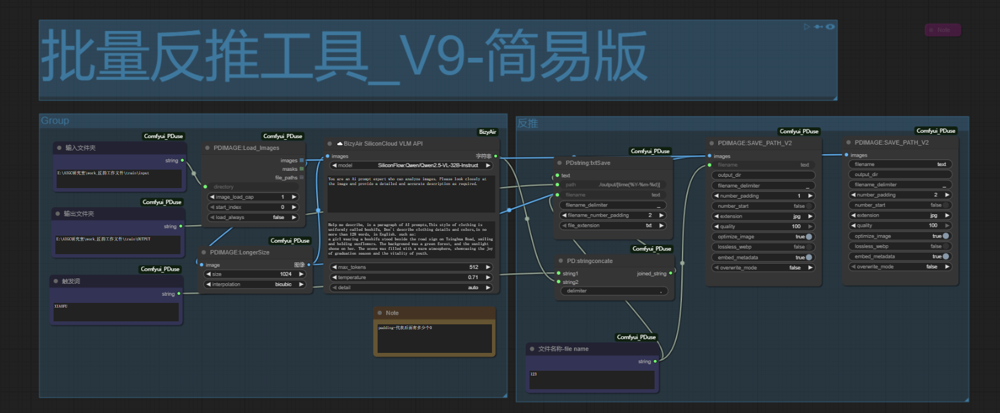

# ComfyUI PDuse
## 目录
- [🚀 功能特性](#-功能特性)
- [⚡ 安装方法](#-安装方法)
- [📖 节点文档](#-节点文档)
  - [文本处理节点](#文本处理节点)
  - [图像处理节点](#图像处理节点)
  - [图像尺寸处理节点](#图像尺寸处理节点)
- [🎯 工作流示例](#-工作流示例)
---

### ⚡ 安装方法

#### 方法一：Git克隆
```bash
cd ComfyUI/custom_nodes
git clone https://github.com/your-username/Comfyui_PDuse.git
cd Comfyui_PDuse
pip install -r requirements.txt
```

#### 方法二：手动下载
1. 从releases下载ZIP文件
2. 解压到`ComfyUI/custom_nodes/`
3. 安装依赖：`pip install -r requirements.txt`
   

## 3. 常见问题
如果节点不能正常加载，或者使用中出现错误，请在ComfyUI终端窗口查看报错信息。以下是常见的错误及解决方法。


## 4. 节点说明

### text处理

##### PD:Image Blend Text

> 字体文件可以放入文件夹fonts 。
> 两张图片合在一起，然后两个文字分别加上去，制作对比图使用。

- image1+ ​​​​image2 ：尽量要求同样尺寸，如果不同，会自动等比例缩放对齐
- text1 + text2   ：支持中文，需字体文件包含中文编码，可输入如"效果图"："原图"之类
- font_size​：小于20可能看不清，大于80可能超出画布
- ​​padding_up​：文字​​上方​​的留白高度，10-30
- ​​padding_down：文字​**​下方​**​的留白高度  10- 1000 ,可以往下扩多一些方便排版
- font_file​  选择字体样式, 需将.ttf/.otf文件放入插件目录的fonts文件夹
##### PD_Text Overlay Node
> PD_Text Overlay Node 主要作用是给图片添加文字，并且指定位置贴上去。


- image：要处理的输入图片
- text：需要叠加的文字内容 
- font_size：字体大小 
- font_color：文字颜色，使用HEX格式，如#000000 
- position_x：文字水平位置（0到1，0是左，1是右） 
- position_y：文字垂直位置（0到1，0是上，1是下） 
- letter_gap：字符间距（可为负数，负数使字母靠近） 
- font_name：使用的字体文件名（从fonts目录中选择）
##### PD:imageconcante_V1

- 两张图合并一起。
### image处理

#### **PDIMAGE:Load_Images 节点说明**


**功能说明：**
批量图片加载节点，用于从指定目录中加载多张图片，支持多种加载选项和缓存控制。

**参数说明：**
- **directory**：图片文件夹路径（必填）
  - 支持相对路径和绝对路径
  - 自动扫描支持的图片格式（jpg、jpeg、png、webp）
- **image_load_cap**：加载数量限制（可选）
  - 默认值：0（无限制）
  - 设置具体数值可限制加载的图片数量
- **start_index**：起始索引（可选）
  - 默认值：0（从第一张开始）
  - 用于跳过前面的图片，从指定位置开始加载
- **load_always**：强制重新加载（可选）
  - 默认值：False（使用缓存）
  - True：每次运行都重新加载，忽略缓存

#### **PDIMAGE_SAVE_PATH:**


**功能说明：**
图片保存路径管理节点，用于设置和管理图片的保存路径，支持自定义文件名格式和目录结构。

**参数说明：**
- **save_path**：保存路径设置
  - 支持相对路径和绝对路径
  - 可包含变量占位符，如 {timestamp}、{counter} 等
- **filename_format**：文件名格式
  - 支持自定义前缀、后缀
  - 支持时间戳、计数器等动态命名
- **create_subdirs**：是否创建子目录
  - 自动创建不存在的目录结构
  - 支持按日期、类型等分类保存

**功能特点：**
- 输出为image，mask 和paths.

#### **PDIMAGE_SAVE_PATHV2:**


**参数说明：**
  - 示例：`MyImage_[date]` → `MyImage_2024-01-01`
- **custom_output_dir**：自定义输出目录路径
  - 支持相对路径和绝对路径
  - 支持时间令牌解析
  - 留空时自动创建以前缀和日期命名的文件夹
- **filename_delimiter**：文件名分隔符（默认"_"）
- **filename_number_padding**：数字填充位数（0-9位）
- **filename_number_start**：数字位置控制
  - `False`：数字在后 → `prefix_0001.png`
  - `True`：数字在前 → `0001_prefix.png`
- **extension**：文件格式选择
  - 支持：`png`、`jpg`、`jpeg`、`webp`、`bmp`、`tiff`
- **quality**：图像质量控制（1-100）
  - 适用于JPEG、WebP、TIFF格式
- **optimize_image**：图像优化开关
  - 启用时减小文件大小，略微增加保存时间
- **lossless_webp**：WebP无损模式
  - 仅对WebP格式有效
- **embed_metadata**：元数据嵌入控制
  - 嵌入提示词和工作流信息到图像文件
- **overwrite_mode**：覆盖模式选择
  - `false`：自动递增文件名避免覆盖
  - `prefix_as_filename`：直接使用前缀作为文件名

#### **PDIMAGE_SAVE_PATHV2:**

**功能说明：**
增强版图片保存路径管理节点，提供更多高级功能和自定义选项，支持多种图片格式、时间令牌和智能文件命名。

**参数说明：**
- **images**：输入图像数组 (B, H, W, C)
- **filename_prefix**：文件名前缀，支持时间令牌
  - 支持令牌：`[time]`、`[date]`、`[datetime]`、`[time(format)]`
  - 示例：`MyImage_[date]` → `MyImage_2024-01-01`
- **custom_output_dir**：自定义输出目录路径
  - 支持相对路径和绝对路径
  - 支持时间令牌解析
  - 留空时自动创建以前缀和日期命名的文件夹
- **filename_delimiter**：文件名分隔符（默认"_"）
- **filename_number_padding**：数字填充位数（0-9位）
- **filename_number_start**：数字位置控制
  - `False`：数字在后 → `prefix_0001.png`
  - `True`：数字在前 → `0001_prefix.png`
- **extension**：文件格式选择
  - 支持：`png`、`jpg`、`jpeg`、`webp`、`bmp`、`tiff`
- **quality**：图像质量控制（1-100）
  - 适用于JPEG、WebP、TIFF格式
- **optimize_image**：图像优化开关
  - 启用时减小文件大小，略微增加保存时间
- **lossless_webp**：WebP无损模式
  - 仅对WebP格式有效
- **embed_metadata**：元数据嵌入控制
  - 嵌入提示词和工作流信息到图像文件
- **overwrite_mode**：覆盖模式选择
  - `false`：自动递增文件名避免覆盖
  - `prefix_as_filename`：直接使用前缀作为文件名


#### **PD:imageconcante_V1 节点说明**


用于将两张图片按指定方向拼接，支持多种尺寸对齐和裁切方式。
image2 不输入则直接输出img1 的结果，方便适应不同任务情况。

**参数说明：**
- **image1**：输入图片1（必填）
- **image2**：输入图片2（可选，不填时只输出image1）
- **direction**：合并方向，可选 right（右拼接）、down（下拼接）、left（左拼接）、up（上拼接）
- **match_size**：尺寸对齐方式
  - `longest`：两张图片都按最长边等比缩放后合并，保持各自比例
  - `crop by image1`：image2 先等比缩放到能覆盖image1，再以image1尺寸为基准进行裁切
- **image2_crop**：当 match_size 选择 `crop by image1` 时，image2 的裁切方式
  - `center`：居中裁切
  - `top`：顶部裁切
  - `bottom`：底部裁切
  - `left`：左侧裁切
  - `right`：右侧裁切

**典型用法举例：**
- 横向拼接两张不同尺寸图片，选择 `longest` 可自动等比缩放对齐高度。
- 需要严格对齐image1尺寸时，选择 `crop by image1` 并设置裁切方式。

### **PD:Image Blend V1 节点说明**


用于将两张图片进行混合，支持多种混合模式、透明度控制和位置调整。
**参数说明：**
- **background_image**：背景图像（必填）
- **layer_image**：图层图像（必填）
- **blend_mode**：混合模式，支持以下选项：
```
  - `normal`：正常混合
  - `multiply`：正片叠底
  - `screen`：滤色
  - `overlay`：叠加
  - `soft_light`：柔光
  - `hard_light`：强光
  - `color_dodge`：颜色减淡
  - `color_burn`：颜色加深
  - `darken`：变暗
  - `lighten`：变亮
  - `difference`：差值
  - `exclusion`：排除
```
- **opacity**：透明度（0-100）
- **x_percent**：X轴位置百分比（50为居中）
- **y_percent**：Y轴位置百分比（50为居中）
- **scale**：缩放比例（0.01到10）
- **align_mode**：对齐模式,设置上下左右。
- **layer_mask**：可选的图层遮罩
- **invert_mask**：是否反转遮罩（默认False）

---

## 5. 节点界面展示

### 图片尺寸处理节点
#### PD:Image Ratio Crop：


**功能说明：**
根据指定比例和最长边长度进行中心裁切，支持自定义比例和输出尺寸。

**参数说明：**
- **image**：输入图像张量 (B, H, W, C)
- **ratio_a**：比例A（1-100）
- **ratio_b**：比例B（1-100）
- **max_size**：输出图像的最长边长度

#### PD:longgersize


**功能说明：**
将图像的长边缩放到指定尺寸，同时保持宽高比，短边按比例缩放。

#### PD:image_resize_v1


**功能说明：**
图片缩放节点，支持通过最长边或最短边缩放图片，输出为缩放后的图片和对应的mask。

**参数说明：**
- **pixels**：输入图片张量 (B, H, W, C)
- **resize_mode**：缩放模式
  - `longest`：按最长边缩放
  - `shortest`：按最短边缩放
- **target_size**：目标尺寸（64-8192）
- **mask_optional**：可选的mask输入 (B, H, W)

**功能特点：**
- 保持图像原始比例，不进行裁切
- 支持最长边和最短边两种缩放模式
- 自动生成或缩放对应的mask
- 使用双三次插值算法，保证图像质量

#### PD:imagesize_v2


**功能说明：**
图片缩放裁切节点V2，支持三种处理模式：纯缩放、比例裁切、强制拉伸。

**参数说明：**
- **pixels**：输入图片张量 (B, H, W, C)
- **resize_mode**：缩放模式（longest/shortest）
- **target_size**：目标尺寸（64-8192）
- **crop_mode**：裁切模式
  - `none`：不改变比例，只缩放
  - `crop`：按比例裁切后缩放
  - `stretch`：强制拉伸到目标比例
- **ratio_a/ratio_b**：目标比例（1-100）
- **horizontal_align**：水平对齐方式（left/center/right）
- **vertical_align**：垂直对齐方式（top/center/bottom）
- **mask_optional**：可选的mask输入

**功能特点：**
- 三种裁切模式满足不同需求
- 支持多种对齐方式，精确控制裁切位置
- 自动处理mask的同步缩放和裁切
---

## 6. 应用工作流：workflow
批量打标：
