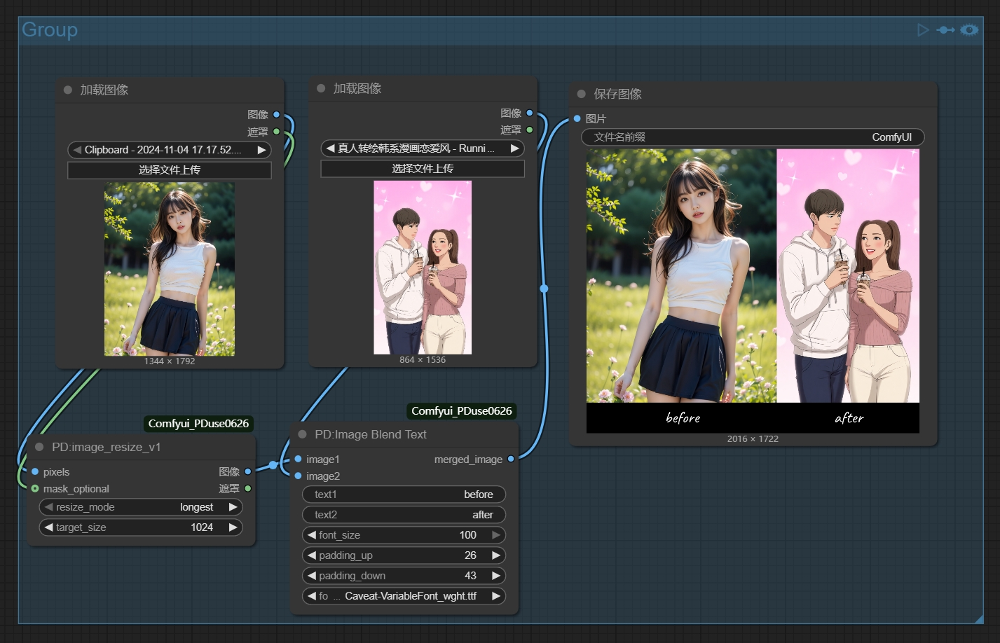
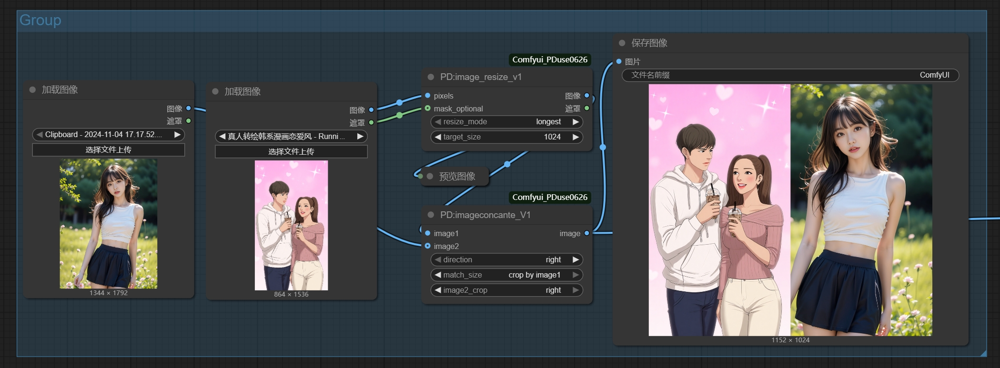
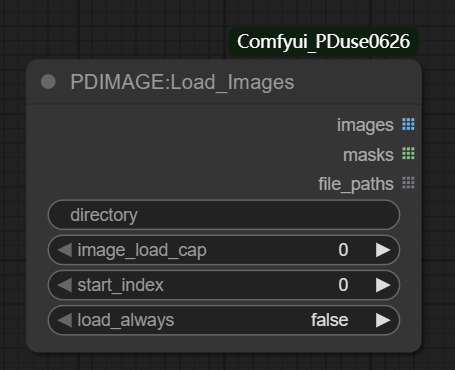
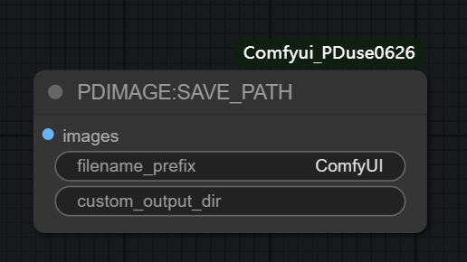
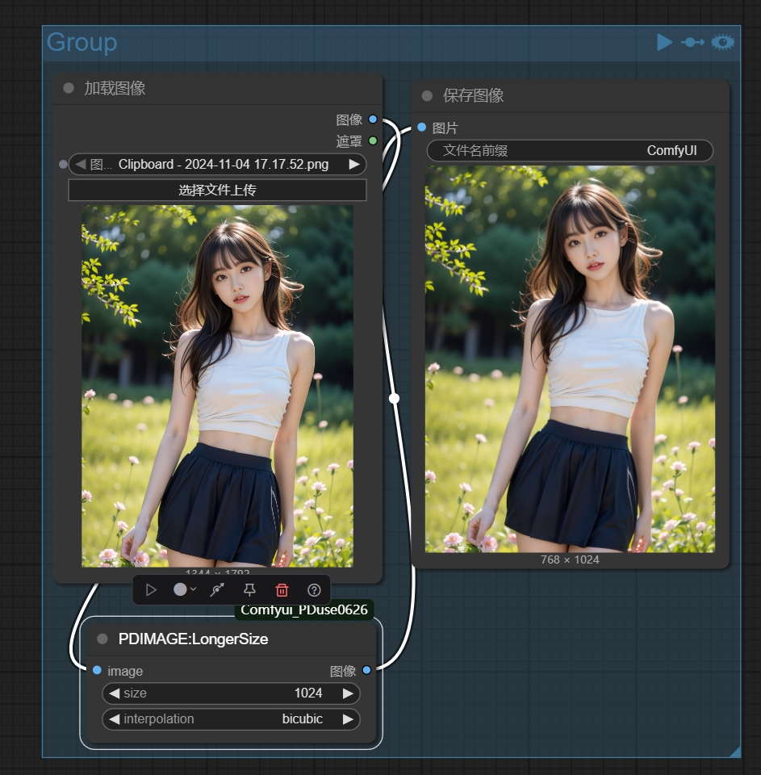
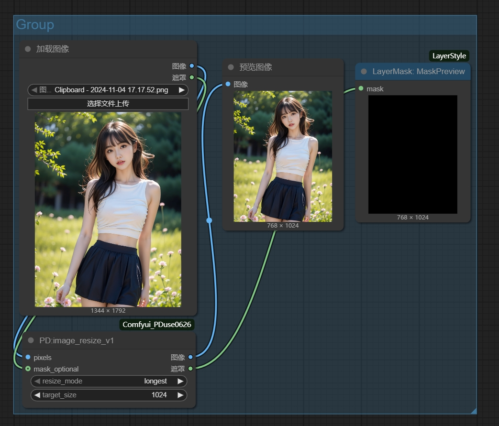
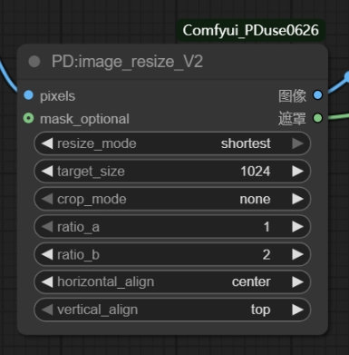

[工作流合集](https://github.com/7BEII/Comfyui_PDuse/tree/master/img)|[视频介绍](https://www.bilibili.com/video/BV11TVwzYE9y/?spm_id_from=333.1387.collection.video_card.click&vd_source=fc2e074d346648621ecd8ea61bc80073)|[节点介绍文档](https://kfecan834o.feishu.cn/wiki/Eeyuw2rDiisTVkk30GRcHsmBnld?from=from_copylink)

## 🚀 特色和节点介绍：
- Comfyui PDuse 制作是方便处理一些 常用的图像 json 和txt 各种繁琐python操作集成到comfyui节点里面，后续有空会持续维护。
- 
  
## ⚡ 安装方法

#### 方法一：Git克隆
```bash
cd ComfyUI/custom_nodes
git clone https://github.com/your-username/Comfyui_PDuse.git
cd Comfyui_PDuse
pip install -r requirements.txt
```

#### 方法二：手动下载
1. 从releases下载ZIP文件 or 网盘 PD源代码备份：https://pan.quark.cn/s/ac4cf8544857#/list/share
2. 解压到`ComfyUI/custom_nodes/`
3. 安装依赖：`pip install -r requirements.txt`
   

## 📖 节点说明

### text处理


##### PD:Image Blend Text

> 字体文件可以放入文件夹fonts 。
> 两张图片合在一起，然后两个文字分别加上去，制作对比图使用。

- image1+ ​​​​image2 ：尽量要求同样尺寸，如果不同，会自动等比例缩放对齐
- text1 + text2   ：支持中文，需字体文件包含中文编码，可输入如"效果图"："原图"之类
- font_size​：小于20可能看不清，大于80可能超出画布
- ​​padding_up​：文字​​上方​​的留白高度，10-30
- ​​padding_down：文字​**​下方​**​的留白高度  10- 1000 ,可以往下扩多一些方便排版
- font_file​  选择字体样式, 需将.ttf/.otf文件放入插件目录的fonts文件夹
##### PD_Text Overlay Node

> 给图片添加文字，并且指定位置贴上去。

- image：要处理的输入图片
- text：需要叠加的文字内容 
- font_size：字体大小 
- font_color：文字颜色，使用HEX格式，如#000000 
- position_x：文字水平位置（0到1，0是左，1是右） 
- position_y：文字垂直位置（0到1，0是上，1是下） 
- letter_gap：字符间距（可为负数，负数使字母靠近）
- font_name：使用的字体文件名（从fonts目录中选择）

##### PD:imageconcante_V1

> 两张图片按指定方向拼接合并。

- image1：输入图片1（必填）
- image2：输入图片2（可选，不填时只输出image1）
- direction：合并方向（right/down/left/up）
- match_size：尺寸对齐方式（longest/crop by image1）
- image2_crop：裁切位置（center/top/bottom/left/right）
### image处理

##### PDIMAGE:Load_Images

> 批量图片加载节点，从指定目录中加载多张图片，支持多种加载选项和缓存控制。

- directory：图片文件夹路径（必填）
- image_load_cap：加载数量限制（0为无限制）
- start_index：起始索引（从第几张开始加载）
- load_always：强制重新加载（True时忽略缓存）

##### PDIMAGE_SAVE_PATH

> 图片保存路径管理节点，设置和管理图片的保存路径，支持自定义文件名格式。

- save_path：保存路径设置
- filename_format：文件名格式（支持前缀、后缀）
- create_subdirs：是否创建子目录

##### PDIMAGE_SAVE_PATHV2

> 增强版图片保存路径管理节点，支持多种图片格式、时间令牌和智能文件命名。

- filename_prefix：文件名前缀（支持时间令牌）
- custom_output_dir：自定义输出目录路径
- filename_delimiter：文件名分隔符
- filename_number_padding：数字填充位数
- extension：文件格式选择
- quality：图像质量控制（1-100）
- embed_metadata：元数据嵌入控制
- overwrite_mode：覆盖模式选择

##### PD:Image Blend V1

> 将两张图片进行混合，支持多种混合模式、透明度控制和位置调整。
- background_image：背景图像（必填）
- layer_image：图层图像（必填）
- blend_mode：混合模式（normal/multiply/screen/overlay等）
- opacity：透明度（0-100）
- x_percent/y_percent：位置百分比（50为居中）
- scale：缩放比例（0.01到10）
- align_mode：对齐模式
- layer_mask：可选图层遮罩
- invert_mask：是否反转遮罩

##### PD:Image Ratio Crop

> 根据指定比例和最长边长度进行中心裁切，支持自定义比例和输出尺寸。

- image：输入图像张量
- ratio_a：比例A（1-100）
- ratio_b：比例B（1-100）
- max_size：输出图像的最长边长度

##### PD:longgersize

> 将图像的长边缩放到指定尺寸，同时保持宽高比，短边按比例缩放。

- image：输入图像
- size：目标长边尺寸
- interpolation：插值方式

##### PD:image_resize_v1

> 图片缩放节点，支持通过最长边或最短边缩放图片，输出缩放后的图片和mask。

- pixels：输入图片张量
- resize_mode：缩放模式（longest/shortest）
- target_size：目标尺寸（64-8192）
- mask_optional：可选的mask输入

##### PD:imagesize_v2

> 图片缩放裁切节点V2，支持三种处理模式：纯缩放、比例裁切、强制拉伸。

- pixels：输入图片张量
- resize_mode：缩放模式（longest/shortest）
- target_size：目标尺寸（64-8192）
- crop_mode：裁切模式（none/crop/stretch）
- ratio_a/ratio_b：目标比例（1-100）
- horizontal_align：水平对齐方式
- vertical_align：垂直对齐方式
- mask_optional：可选的mask输入

##### PD_CropBorder

> 智能图像边框裁切节点，自动检测并移除图片边缘的黑色或白色边框。

- image：输入图像张量
- border_color：要移除的边框颜色（black/white）
- threshold：颜色检测阈值（0-255）
- padding：裁切后保留的边距像素（0-100）

##### PD_BatchCropBlackBorder

> 批量图像边框裁切节点，批量处理文件夹中的所有图片，自动检测并移除边框。

- input_path：输入图片文件夹路径（必填）
- border_color：要移除的边框颜色（black/white）
- threshold：颜色检测阈值（0-255）
- padding：裁切后保留的边距像素（0-100）
- output_path：输出路径（可选，不填则覆盖原图）

##### PDJSON_Group

> JSON文件输出路径和格式设置节点。

- directory_path：JSON文件输出目录路径
- color_choice：颜色选择
- modify_size：尺寸修改选项
- font_size：字体大小
- target_title：目标标题
- output_folder：输出文件夹
- new_filename：新文件名

---
## 🎯 应用工作流：workflow

在img目录下有json格式的工作流示例文件，示范了如何在ComfyUI中使用这些节点。

**批量打标：**

[批量反推工具_V9.1-简易版工作流](img/批量反推工具_V9.1-简易版.json)